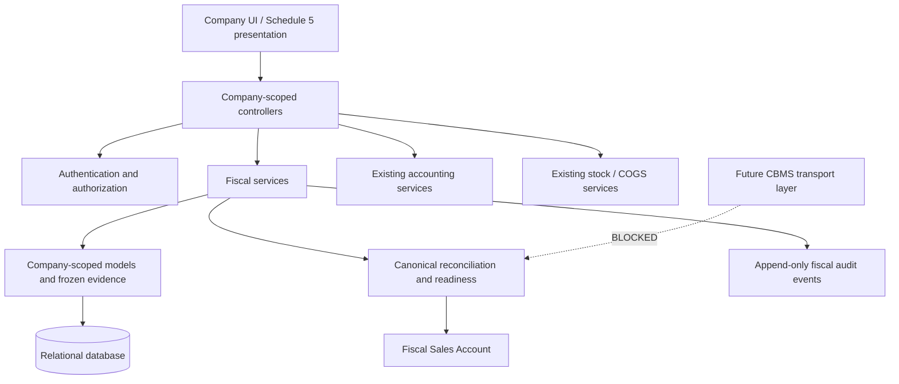

# DG ERP — Nepal IRD Electronic Billing Technical Documentation

## A. Document control

| Field | Value |
|---|---|
| Product | DG ERP |
| Developer/Provider | DGTAS — Digital Global Technology & Advanced Solutions |
| Legal registration | Pending legal registration details |
| Purpose | Technical foundation for IRD listing review, CA review, security review, future CBMS integration, and internal maintenance |
| Version | 1.0-draft |
| Prepared | 2026-09-10 |
| Approval status | Internal technical draft; not IRD-approved or IRD-listed |
| Current status | Fiscal architecture implemented and regression-tested; CBMS HTTP transmission blocked pending written IRD clarification |

Status terms in this document are precise: **IMPLEMENTED** means present in source; **VERIFIED BY TEST** means covered by the current automated suite; **PLANNED** means not implemented; **BLOCKED** means implementation is intentionally withheld pending an external decision.

## B. Product and scope

DG ERP is a Laravel 12 / PHP 8.2+ multi-company ERP. Nepal fiscal behavior is country-gated and coexists with legacy behavior for non-Nepal companies and Nepal companies with CBMS disabled.

The CBMS submission boundary is Sales Invoice and Sales Return/Credit Note only. Purchases, Purchase Returns, Sales Payments, Purchase Payments, Journals, Expenses, Income, and Inventory remain ERP accounting or operational modules; they are not Sales CBMS submission modules.

## C. System architecture

Major implemented services include `NepalIrdCbmsModeService`, `SalesTaxClassificationService`, `SalesFiscalSnapshotService`, `SalesFiscalLineAmountService`, `SalesFiscalPaymentModeService`, `SalesFiscalIssueDateTimeService`, `SalesFiscalReconciliationService`, `SalesFiscalReadinessService`, `FiscalDocumentPolicyService`, `FiscalDocumentAuditService`, and `SalesFiscalReportService`.

## D. Multi-company security and roles

Business queries derive company scope from the authenticated user and constrain documents and related masters by `company_id`. Route/controller authorization uses company permissions. Cross-company document, relationship, reporting, and settings access is regression-tested.

Company Admin retains administrative authority. Company Staff uses assigned module plus action permissions. Auditor is a separate company-bound account with role-level read permissions. `EnsureAuditorReadOnly` permits only named GET/HEAD evidence routes and rejects all mutation requests and mutation-form routes. Auditor cannot manage users, permissions, FY settings, CBMS state, reset, deletion, submission, or retry.

## E. Nepal fiscal mode and permanent evidence

**Current mode:** a new document enters Nepal fiscal processing only when the canonical Country Master ISO code is `NP`, the persisted IRD/CBMS setting is enabled, and `NepalIrdCbmsModeService` resolves the mode active.

**Durable document evidence:** after successful fiscal issuance, `fiscal_issued_at`, frozen evidence, and fiscal audit history identify the document permanently. Later setting corruption or forced disable does not make an issued document mutable or remove FY/reset/deletion protection.

## F. Sales Invoice lifecycle

The actual store flow performs authorization, authenticated-company resolution, request validation, active-FY/date validation, server-reserved company/FY invoice-number validation, company-scoped customer/item validation, and authoritative fiscal-mode locking inside a database transaction. It then creates the invoice and lines, freezes seller/buyer/item/unit/HS/origin, discount/net-base, payment-mode, and issue-time evidence where fiscal mode applies, posts the existing customer/accounting/stock/COGS effects, runs canonical reconciliation, writes `fiscal_issued_at`, and records `invoice_issued`. A thrown exception rolls back the transaction and produces no false issuance event.

Invoice numbering is company- and FY-scoped. The authoritative business date remains the AD database value; the BS date is derived centrally for Nepal display.

## G. Sales Return / Credit Note lifecycle

A return is linked to a company-scoped original invoice and active FY. A fiscal return requires a meaningful frozen reason. The server assigns the company/FY return number, verifies remaining quantities, and copies frozen classification and item evidence. Full, partial, repeated partial, and final residual returns use frozen quantity shares; the final residual absorbs remaining discount, net base, VAT, and total to prevent rounding drift.

The existing return flow restores stock using the original cost snapshot, posts the established accounting reversal, runs `reconcileReturn()`, records `fiscal_issued_at`, and appends Credit Note audit evidence in the same transaction. Issued Credit Notes remain immutable even if current CBMS mode is later forced off.

## H. Tax and item evidence

Canonical classifications are:

- `vat_taxable`: the only class permitted to carry positive VAT.
- `vat_exempt`, `zero_rated`, `export`, `out_of_scope`: require zero VAT under current project rules.
- `legacy_unclassified`: unresolved historical evidence and not silently remapped.

Imported physical products require valid frozen HS evidence, including imported exempt products. Domestic product HS is optional. Services do not fabricate physical origin or HS details. Missing or inconsistent historical evidence remains NOT READY.

## I. Fiscal arithmetic

`SalesFiscalLineAmountService` calculates two-decimal line gross base, explicit line discount, fiscal net base, VAT on the discounted base, and line total. `SalesFiscalReconciliationService` is the canonical reconciliation authority. It independently aggregates taxable, exempt, zero-rated, export, and out-of-scope net bases and verifies:

- gross less discount equals net sales;
- classification buckets equal net sales;
- net sales plus VAT equals grand total;
- persisted headers equal canonical line aggregates.

Future Nepal fiscal invoices use explicit line-level discount evidence. The system does not guess global-discount allocation.

## J. Payment presentation

Issuance-time mapping is frozen as follows:

| Source mode | Presentation |
|---|---|
| cash | Cash |
| credit | Credit |
| bank | Other (Bank Transfer) |
| digital | Other (Digital Payment) |
| mixed | Other (Mixed) |
| other | Other |

Later Sales Payments do not rewrite this evidence. No authoritative issuance-time Cheque mapping is claimed.

## K. Schedule 5 presentation

The implemented fiscal invoice view presents the authoritative invoice number, seller PAN and identity, transaction date, fiscal issue date/time, buyer identity/PAN, payment presentation, applicable HS/item evidence, quantity/unit, unit price, gross, discount, classified/taxable base, VAT rate, VAT, line total, tax summary, grand total, Original/Reprint label, and seller signature area. Fiscal arithmetic is supplied by services rather than recalculated in Blade. This is implementation support, not a claim of IRD certification.

## L. Original/Reprint

The first eligible fiscal print records **Original**. Later prints append **Copy of Original (1)**, **(2)**, and so on. Sequence assignment is server-controlled under a row lock; request copy-number forgery is not authoritative. Views do not increment the sequence, and failed readiness does not create print evidence.

## M. Fiscal audit trail

Implemented event concepts include `invoice_issued`, Credit Note `issued`, `original_printed`, `reprinted`, `sales_return_created`, and protected update/cancel/delete/company-deletion attempts. Events are company/document-scoped and append-only; singleton events use durable deduplication keys. Metadata contains fiscal identifiers and safe reconciliation evidence, not credentials.

General user/role-assignment auditing is not implemented as a dedicated audit engine; this is an open governance item.

## N. Immutability and destructive protection

Application services block edit/update, direct cancellation, deletion, company factory reset, company permanent deletion, and material FY mutation when permanent fiscal evidence exists. Database foreign keys restrict detaching fiscal invoices from FYs, cascading Credit Notes, deleting protected companies/FYs, and erasing fiscal audit history. Application and database controls provide defense in depth.

## O. Accounting and inventory integrity

Fiscal evidence does not replace accounting truth. Existing services remain authoritative for Sales revenue, output VAT payable, customer balance, optional issuance-time payment, COGS, stock-out, Sales Return revenue/VAT/customer reversal, and stock restoration. Fiscal totals are reconciled against the same persisted transaction values. No new accounting or stock formulas were introduced by this documentation phase.

## P. Fiscal Sales Account

The company-scoped report includes only durable fiscal invoices and Credit Notes. It uses frozen buyer evidence and canonical tax buckets; returns subtract from the corresponding original buckets. FY/date filters are authoritative AD filters. Incomplete or `legacy_unclassified` rows remain visible as NOT READY but are excluded from official totals. Legacy documents are excluded. The report is not represented as an independently IRD-approved prescribed report.

## Q. Auditor

Auditor is a company-scoped, separately authenticated, read-only role. It can inspect representative transactions, ledgers, statements, fiscal reports, fiscal history, profile/tax identity, and FY information. A centralized server gate denies mutation methods and non-approved routes; cross-company evidence is not exposed. Auditor cannot submit/retry CBMS, alter settings, manage users, reset, or delete.

## CBMS Integration Status — PHASE 1B ERP-SIDE OPERATIONAL; LIVE SUBMISSION BLOCKED

Officially identified endpoints are:

- Sales Invoice: `https://cbapi.ird.gov.np/api/bill`
- Sales Return/Credit Note: `https://cbapi.ird.gov.np/api/billreturn`

Existing configuration is company-scoped and stores environment, client identifier, an encrypted credential, and configuration actors. The credential uses Laravel encrypted casting and is hidden from serialization. No real credential is included in this documentation.

Dedicated Sales Bill and Bill Return builders, structured readiness, supported tax mapping, BS wire formatters, an isolated realtime classifier, durable idempotent transmission records, endpoint-specific response parsers, and a mockable transport boundary are implemented. `total_sales` uses the authoritative VAT-inclusive grand total. Generic `zero_rated`, `out_of_scope`, and `legacy_unclassified` remain transmission NOT READY rather than being guessed. Response ambiguity never produces automatic success.

The default transport binding always blocks network access. Phase 1B adds after-commit local queueing, a controlled job/processor, bounded retry classification, immutable attempt evidence, safe manual retry, and verifier-only duplicate reconciliation. The verifier defaults unavailable, so no duplicate can be manually asserted successful. Production connectivity and real external verification are **not implemented**. See `DG_ERP_CBMS_IMPLEMENTATION_PHASE_1B.md`.

## Test architecture

Focused Feature and Unit tests are consolidated through `phpunit.compliance.xml`. Tests run only in SQLite `:memory:` and refuse a non-testing database. The current verified evidence is summarized in `DG_ERP_IRD_TEST_EVIDENCE.md`.
